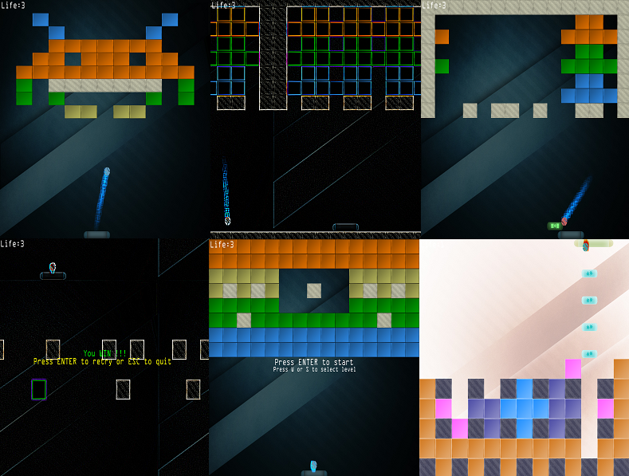
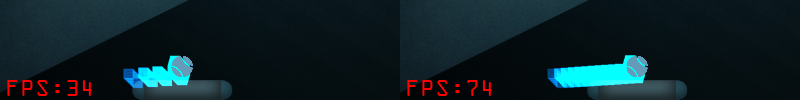
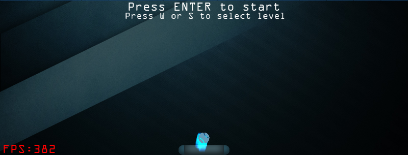

# Breakout
基于[LearnOpenGL教程](https://learnopengl-cn.github.io/06%20In%20Practice/2D-Game/01%20Breakout/)（[LearnOpenGL tutorial](https://learnopengl.com/In-Practice/2D-Game/Breakout)）的2D实战项目Breakout游戏

以下是部分游戏运行截图


## 新增 & 优化
在原教程项目代码的基础上做了以下新增与优化

* 添加了更多的代码注释
* 适配MacOS平台，修复原教程代码在retian屏幕上出现的场景仅显示四分之一，物体大小异常等渲染问题
* 优化文本渲染方式，将所有字形纹理合并到大的贴图上，从而减少纹理的切换
* 优化三角形渲染方式，使用 `GL_TRIANGLE_STRIP`节省约三分之一需要传递的数据量
* 优化粒子绘制效率，使用实例化渲染，以下截图是在总粒子数100000，每个dt更新1000个粒子的情况下，优化前后帧率对比


* 新增按`P`键，打开或关闭左下角游戏帧率（FPS）显示


* 新增画中画工具类，支持在屏幕右上角绘制任意贴图


## 编译 & 运行
克隆项目代码，在项目根目录执行以下命令
* 克隆子模块，依赖于[glfw](https://github.com/glfw/glfw)和[glm](https://github.com/g-truc/glm)
```
$ git submodule update --init
```
* 执行cmake
```
$ mkdir build
$ cd build
$ cmake ..
$ cmake --build .
```
已在以下平台编译通过
| 系统 | 版本 |
|---|---|
| Windows | Windows10 专业版 1903 |
| MacOS | Mojave 10.14.5 | 
| Linux | CentOS release 7.7.1908 |
> 注意：在MacOS平台编译构建生成可执行文件后，需要通过终端执行`./Breakout`命令启动应用。如果直接双击启动，可能由于工作目录不是当前可执行文件所在目录，导致出现资源文件加载失败问题 

## 更多
* 与LearnOpenGL教程一致，不包含任何新增功能与优化的源码可以查看[standard分支](https://github.com/iwiniwin/Breakout/tree/standard)
* 将LearnOpenGL教程中每一章节对应为一个场景的[学习笔记项目](https://github.com/iwiniwin/LearnOpenGL)